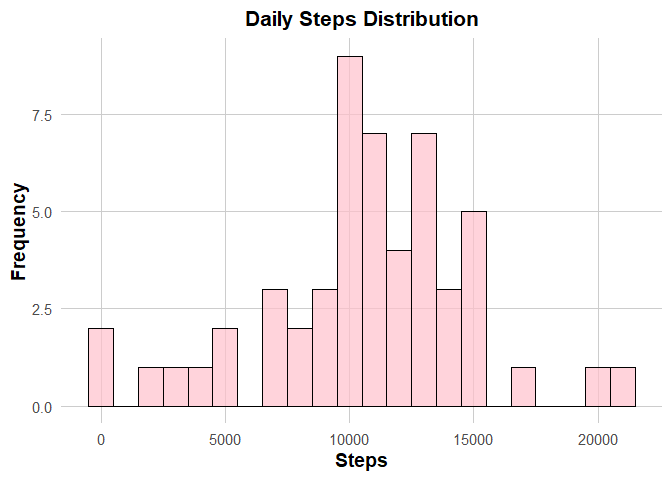
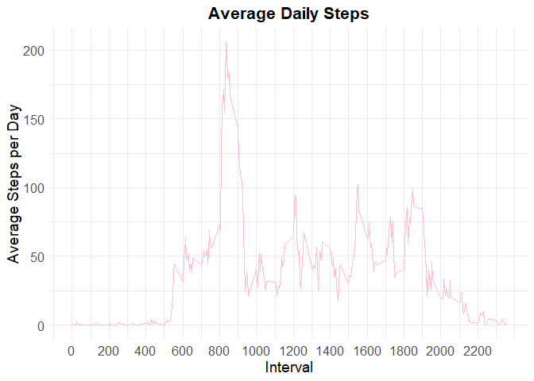
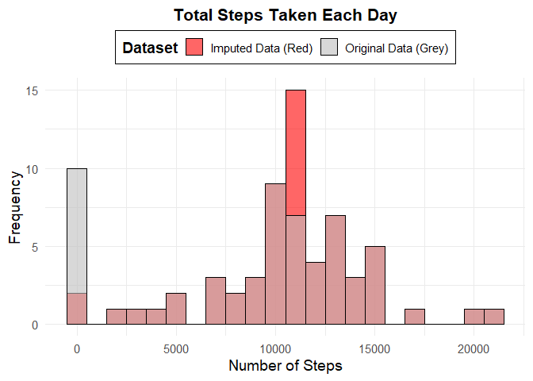
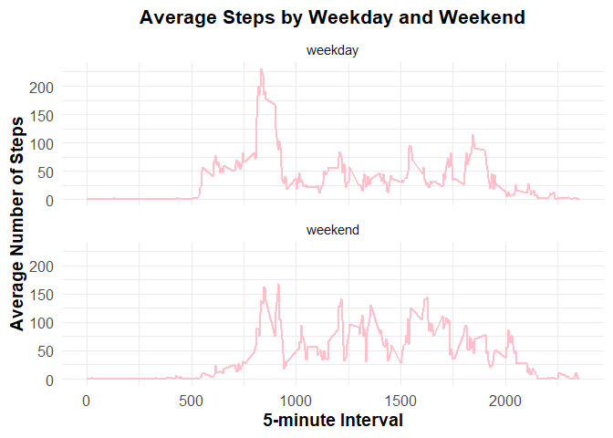

``` r
knitr::opts_chunk$set(
  fig.path = "figure/"
)
```

# Introduction

It is now possible to collect a large amount of data about personal
movement using activity monitoring devices such as a
[Fitbit](https://store.google.com/es/category/watches_trackers?hl=es&utm_source=fitbit_redirect&utm_medium=google_ooo&utm_campaign=category&pli=1 "Fitbit"),
[Nike
Fuelband](https://www.nike.com/help/a/why-cant-i-sync "Nike Fuelband"),
or [Jawbone Up](https://www.jawbone.com/up "Jawbone Up"). These type of
devices are part of the “quantified self” movement – a group of
enthusiasts who take measurements about themselves regularly to improve
their health, to find patterns in their behavior, or because they are
tech geeks. But these data remain under-utilized both because the raw
data are hard to obtain and there is a lack of statistical methods and
software for processing and interpreting the data.

This assignment makes use of data from a personal activity monitoring
device. This device collects data at 5 minute intervals through out the
day. The data consists of two months of data from an anonymous
individual collected during the months of October and November, 2012 and
include the number of steps taken in 5 minute intervals each day.

# Libraries

``` r
library(lubridate)
library(ggplot2)
library(dplyr)
library(hrbrthemes)
library(data.table)
```

# Data

The data for this assignment can be downloaded from the course web site:

-   Dataset: [Activity monitoring
    data](https://d396qusza40orc.cloudfront.net/repdata%2Fdata%2Factivity.zip "Activity monitoring data")
    \[52K\]

The variables included in this dataset are:

-   **steps**: Number of steps taking in a 5-minute interval (missing
    values are coded as NA)

-   **date**: The date on which the measurement was taken in YYYY-MM-DD
    format

-   **interval**: Identifier for the 5-minute interval in which
    measurement was taken

The dataset is stored in a comma-separated-value (CSV) file and there
are a total of 17,568 observations in this dataset.

## Loading and preprocessing the data

Show any code that is needed to

Load the data (i.e.  read.csv() read.csv())

Downloading and unzipping data to obtain the csv file.

``` r
# Define file and directory paths
zipUrl <- "https://d396qusza40orc.cloudfront.net/repdata%2Fdata%2Factivity.zip"
zipFile <- "getdata-projectfiles-UCI HAR Dataset.zip"

# Download the zip file if it doesn't exist
if(!file.exists(zipFile)) {
        temp <- tempfile()
        download.file(zipUrl,temp)
        unzip(temp)
        unlink(temp)
}
```

Reading csv.

``` r
activity_data <- read.csv("activity.csv", header=T, quote="\"", sep=",")
head(activity_data)
```

    ##   steps       date interval
    ## 1    NA 2012-10-01        0
    ## 2    NA 2012-10-01        5
    ## 3    NA 2012-10-01       10
    ## 4    NA 2012-10-01       15
    ## 5    NA 2012-10-01       20
    ## 6    NA 2012-10-01       25

Process/transform the data (if necessary) into a format suitable for
your analysis

# What is mean total number of steps taken per day?

For this part of the assignment, you can ignore the missing values in
the dataset.

1.  Calculate the total number of steps taken per day

``` r
totalSteps <- activity_data %>%
  group_by(date) %>%
  summarise(steps = sum(steps, na.rm = FALSE))

head(totalSteps)
```

    ## # A tibble: 6 × 2
    ##   date       steps
    ##   <chr>      <int>
    ## 1 2012-10-01    NA
    ## 2 2012-10-02   126
    ## 3 2012-10-03 11352
    ## 4 2012-10-04 12116
    ## 5 2012-10-05 13294
    ## 6 2012-10-06 15420

1.  If you do not understand the difference between a histogram and a
    barplot, research the difference between them. Make a histogram of
    the total number of steps taken each day

``` r
ggplot(totalSteps, aes(x = steps)) +
    geom_histogram(fill = "pink", color = "black", binwidth = 1000, alpha = 0.7) +
    labs(title = "Daily Steps Distribution", x = "Steps", y = "Frequency") +
    theme_minimal(base_size = 14) +
    theme(plot.title = element_text(hjust = 0.5, face = "bold", size = 16),
          axis.title = element_text(face = "bold"),
          panel.grid.major = element_line(color = "gray80"),
          panel.grid.minor = element_blank())
```

    ## Warning: Removed 8 rows containing non-finite outside the scale range
    ## (`stat_bin()`).



1.  Calculate and report the mean and median of the total number of
    steps taken per day

``` r
totalSteps %>%
  summarise(
    Mean_Steps = mean(steps, na.rm = TRUE),
    Median_Steps = median(steps, na.rm = TRUE)
  )
```

    ## # A tibble: 1 × 2
    ##   Mean_Steps Median_Steps
    ##        <dbl>        <int>
    ## 1     10766.        10765

# What is the average daily activity pattern?

1.  Make a time series plot (i.e.  type = “l” type = “l”) of the
    5-minute interval (x-axis) and the average number of steps taken,
    averaged across all days (y-axis)

``` r
intervalDT <- activity_data %>%
  group_by(interval) %>%
  summarise(steps = mean(steps, na.rm = TRUE))

ggplot(intervalDT, aes(x = interval, y = steps)) + 
  geom_line(color = "pink", linewidth = 0.5) +  # linewidth en lugar de size para evitar advertencias
  labs(title = "Average Daily Steps", 
       x = "Interval", 
       y = "Average Steps per Day") +
  theme_minimal() + 
  theme(
    plot.title = element_text(hjust = 0.5, face = "bold", size = 16),  # Título más grande y centrado
    axis.title = element_text(size = 14),  # Etiquetas de los ejes más grandes
    axis.text = element_text(size = 12)  # Números de los ejes más legibles
  ) +
  scale_x_continuous(breaks = seq(0, max(intervalDT$interval), by = 200))  # Mejora la legibilidad del eje X
```



1.  Which 5-minute interval, on average across all the days in the
    dataset, contains the maximum number of steps?

``` r
intervalDT$interval[which.max(intervalDT$steps)]
```

    ## [1] 835

# Imputing missing values

Note that there are a number of days/intervals where there are missing
values (coded as NA NA). The presence of missing days may introduce bias
into some calculations or summaries of the data.

1.  Calculate and report the total number of missing values in the
    dataset (i.e. the total number of rows with NA NAs)

``` r
sum(is.na(activity_data))
```

    ## [1] 2304

1.  Devise a strategy for filling in all of the missing values in the
    dataset. The strategy does not need to be sophisticated. For
    example, you could use the mean/median for that day, or the mean for
    that 5-minute interval, etc.

``` r
strategy<-activity_data %>%
  mutate(steps = ifelse(is.na(steps), median(steps, na.rm = TRUE), steps))
head(strategy)
```

    ##   steps       date interval
    ## 1     0 2012-10-01        0
    ## 2     0 2012-10-01        5
    ## 3     0 2012-10-01       10
    ## 4     0 2012-10-01       15
    ## 5     0 2012-10-01       20
    ## 6     0 2012-10-01       25

1.  Create a new dataset that is equal to the original dataset but with
    the missing data filled in.

``` r
activity_data_filled <- activity_data %>%
  mutate(steps = ifelse(is.na(steps), median(steps, na.rm = TRUE), steps))
```

1.  Make a histogram of the total number of steps taken each day and
    Calculate and report the mean and median total number of steps taken
    per day. Do these values differ from the estimates from the first
    part of the assignment? What is the impact of imputing missing data
    on the estimates of the total daily number of steps?

``` r
# Calculate total steps per day after imputing missing data
total_steps_per_day_filled <- activity_data_filled %>%
  group_by(date) %>%
  summarise(total_steps = sum(steps, na.rm = TRUE))  # na.rm = TRUE to ignore any remaining NAs

# Create a histogram of the total steps per day (after imputing)
ggplot(total_steps_per_day_filled, aes(x = total_steps)) +
  geom_histogram(fill = "pink", color = "black", binwidth = 1000, alpha = 0.7) +
  labs(title = "Daily Steps Distribution", x = "Steps", y = "Frequency") +
  theme_minimal(base_size = 14) +
  theme(
    plot.title = element_text(hjust = 0.5, face = "bold", size = 16),
    axis.title = element_text(face = "bold"),
    axis.text = element_text(size = 12),
    panel.grid.major = element_line(color = "gray80"),
    panel.grid.minor = element_blank()
  )
```



``` r
# Calculate the mean and median of total steps per day (after imputing)
mean_steps_filled <- mean(total_steps_per_day_filled$total_steps, na.rm = TRUE)
median_steps_filled <- median(total_steps_per_day_filled$total_steps, na.rm = TRUE)

# Print the results (after imputing)
mean_steps_filled
```

    ## [1] 9354.23

``` r
median_steps_filled
```

    ## [1] 10395

# Are there differences in activity patterns between weekdays and weekends?

For this part the weekdays() weekdays() function may be of some help
here. Use the dataset with the filled-in missing values for this part.

1.  Create a new factor variable in the dataset with two levels –
    “weekday” and “weekend” indicating whether a given date is a weekday
    or weekend day.

``` r
activity_data_filled <- activity_data_filled %>%
  mutate(date = as.Date(date))  # Convert the 'date' column to a Date object
# Set the locale to "C" so that weekdays() returns English names
Sys.setlocale("LC_TIME", "C")
```

    ## [1] "C"

``` r
# Create a new variable "day_type" with levels "weekday" and "weekend"
activity_data_filled <- activity_data_filled %>%
  mutate(day_type = ifelse(weekdays(date) %in% c("Saturday", "Sunday"), "weekend", "weekday"))
```

1.  Make a panel plot containing a time series plot (i.e.  type = “l”
    type = “l”) of the 5-minute interval (x-axis) and the average number
    of steps taken, averaged across all weekday days or weekend days
    (y-axis). See the README file in the GitHub repository to see an
    example of what this plot should look like using simulated data.

``` r
# Calculate the average number of steps for each 5-minute interval, grouped by day_type
avg_steps_by_day_type <- activity_data_filled %>%
  group_by(day_type, interval) %>%
  summarise(avg_steps = mean(steps, na.rm = TRUE), .groups = "drop")

# Create the panel plot using ggplot2
ggplot(avg_steps_by_day_type, aes(x = interval, y = avg_steps)) +
  geom_line(color = "pink", linewidth = 0.8) +
  facet_wrap(~day_type, ncol = 1) +
  labs(title = "Average Steps by Weekday and Weekend",
       x = "5-minute Interval",
       y = "Average Number of Steps") +
  theme_minimal(base_size = 14) +
  theme(
    plot.title = element_text(hjust = 0.5, face = "bold", size = 16),
    axis.title = element_text(face = "bold"),
    axis.text = element_text(size = 12)
  )
```


